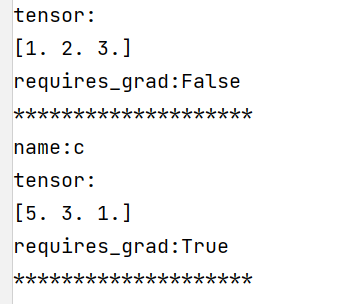
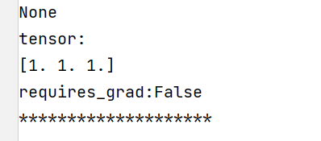
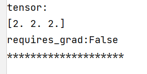
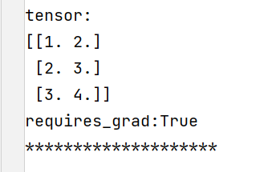

# 类型系统

> Python运行时并不强制标注函数和变量类型。类型标注可被用于第三方工具，比如类型检查器、集成开发环境、静态检查器等。

最基本的支持由`Any`，`Union`，`Tuple`，`Callable`，`TypeVar`和`Generic`类型组成。

函数接受并返回一个字符串，注释像下面这样：

```python
def greeting(name: str) -> str:
    return 'Hello ' + name
```

<!--more-->

在函数 `greeting` 中，参数 `name` 预期是 `str`类型，并且返回 `str`类型。子类型允许作为参数。

```python
greeting(1)  # 发现出现了类型检查错误，应为类型str，但实际为int
greeting('213') + 1  # 发现出现了类型检查错误，应为类型str，但实际为int
```

## 类型别名

类型别名通过将类型分配给别名来定义。

在这个例子中，`Vector`和 `List[float] `将被视为可互换的同义词。

```python
from typing import List
Vector = List[float]  # 元素类型为float的列表

def scale(scale: float, vector: Vector) -> Vector:
    return [scale * num for num in vector]


new_vector1 = scale(1.1, (1, 2, 3))  # 出现类型检查错误，第二个参数应该为List[float]，但是实际为Tuple(int, int, int)
new_vector2 = scale(2.0, [2, 2, 2])
```

类型别名可用于简化复杂类型签名。

```python
from typing import Dict, Tuple, Sequence

ConnectionOptions = Dict[str, str]  # 字典类型，键值对均为字符串
Address = Tuple[str, int]
Server = Tuple[Address, ConnectionOptions]
```

无返回值的时候可指定返回类型为`None`。

```python
def broadcast_message(
        message: str,
        servers: Sequence[Tuple[Tuple[str, int], Dict[str, str]]]) -> None:
    ...
```

```python
msg = '123'
sev = Sequence[(('hello', 123), {'123': '123'})]  
broadcast_message(msg, sev)  # 编译无错误
```

## `NewType`

使用 `NewType() `辅助函数创建不同的类型:

```python
from typing import NewType

UserId = NewType('UserId', int)
some_id = UserId(524313)
```

静态类型检查器会将新类型视为它是原始类型的子类。

这对于帮助捕捉逻辑错误非常有用。

```python
def get_user_name(user_id: UserId) -> str:
    ...
```

```python
user_a = get_user_name(UserId(42351))
user_b = get_user_name(-1)  # 没有通过检查，类型应该为UserID，不应该为int
```

仍然可以对` UserId `类型的变量执行所有的` int `支持的操作，但结果将始终为` int `类型。

这可以让你在需要` int` 的地方传入` UserId`，但会阻止你以无效的方式无意中创建` UserId`。

```python
# 'output' is of type 'int', not 'UserId'
output = UserId(23413) + UserId(54341)
```

静态检查器将`UserId`作为`int`类的子类，但是实际上并不是子类，而会生成一个返回输入值的函数，输入什么返回什么，故无法用于创建子类。

```python
from typing import NewType

UserId = NewType('UserId', int)
# 静态检查器将UserId作为int类的子类，但是实际上并不是子类，而会生成一个返回输入值的函数，输入什么返回什么，故无法用于创建子类

# 运行失败，但是类型检查无问题
# 注意静态类型检查器与Python解释器的区别
class AdminUserId(UserId): ...
```

## `Callable`

定义回调函数   类型标注为` Callable[[Arg1Type, Arg2Type], ReturnType]`

表示回调函数输入参数为两个，类型分别为`（Arg1Type和Arg2Type）`，返回值类型为`ReturnType`

```python
# 该函数输入的回调函数参数形式为：
# 无输入值
# 输出值为str类型
def feeder(get_next_item: Callable[[], str]) -> None:
    ...
    # Body

# 该函数输入的回调函数参数形式为：
# on_success:
# 输入值为int类型
# 无输出值
# on_error:
# 输入值类型为：（int, Exception）
# 无输出值
def async_query(on_success: Callable[[int], None],
                on_error: Callable[[int, Exception], None]) -> None:
    ...
    # Body
```

## `Union`

定义一个联合类型，`Union[X, Y]`意味着：要么是`X`要么是`Y`。

```python
Arrayable = Union[float, List, np.ndarray]

def fun(arg: Arrayable) -> None:
	...

fun('1')  # 未通过类型检查
fun(1.1)  # 通过类型检查
fun([1, 2, 3])  # 通过类型检查
fun(None)  # 未通过检查
```

## `Optional`

可选类型`Optional[x]`等价于`Union[X, None]`

```python
Arrayable = Optional[float, List]

def fun(arg: Arrayable) -> None:
	...

fun('1')  # 未通过类型检查
fun(1.1)  # 通过类型检查
fun([1, 2, 3])  # 通过类型检查
fun(None)  # 也通过检查
```

## `NamedTuple`

为不同的参数定义不同的数据类型。

```python
from typing import NamedTuple

class Employee(NamedTuple):
    name: str
    id: int
```

```python
Employee('name', '123')  # 未通过类型检查
Employee('name', 123)  # 通过类型检查
```

还可以为字段提供默认值，和函数变量一样，带默认值的字段必须在不带默认值的字段后面。

```python
class Employee(NamedTuple):
    name: str
    id: int = 3
```

```python
employee = Employee('name')
print(employee)  # Employee(name='name', id=3)
```

# `Tensor`

从此节开始，将会开始实现自己的深度学习框架中最简单，最基础的类`Tensor`。`Tensor`类可以实现张量的相关计算（包括加、减、乘、除、矩阵乘法、求和、求均值、转置等），同时在进行相关计算时，可以调用反向传播函数求其他参数的梯度。

同时，为了保证类的**可靠性**，在类的搭建过程中引入类型系统进行相关变量的数据类型检查，增强类的可靠性，以及其他人在使用中的**便利性**。

## 准备工作

在设计初始化函数时，首先要搞清楚在类的定义过程中，我们需要传入哪些参数，控制什么功能。

`data`：表示张量的具体数据，在此我们要求data参数的类型必须是`ndarray`，如果传入的是其他类型需要将其转化为`ndarray`。

`requires_grad`：`bool`类型。用来控制是否需要张量参与梯度的计算，在反向传播的时候是否跟踪该`tensor`，如果不跟踪则需要将其从计算图中剔除。

`depends_on`：`List`类型。用来存储在计算过程中与本tensor相关的tensor和求导函数。在反向传播时会使用到该参数进行反向传播。

`name`：用来给`Tensor`命名。

`dtype`：表示`Tensor`的数据类型。

`grad`：用来存储梯度。初始梯度为None。

`shape`：存储`data`的数据尺寸。

```python
from typing import List, NamedTuple, Optional, Union, Callable

import numpy as np
import nn

# 定义Tensor初始化时，data允许传入的数据类型
Arrayable = Union[float,
                  List,
                  np.ndarray]

# 定义Tensor初始化时，dtype允许的数据类型
Dtypeable = Union[int,
                  float,
                  np.unit,
                  np.unit0,
                  np.unit8,
                  np.unit16,
                  np.unit32,
                  np.unit64,
                  np.int0,
                  np.int8,
                  np.int16,
                  np.int32,
                  np.int64,
                  np.float16,
                  np.float32,
                  np.float64]

# 定义depends_on允许的类型
class Dependency(NamedTuple):
    tensor: 'Tensor'
    grad_fn: Callable[[np.ndarray], np.ndarray]  # 定义梯度求解的输入输出
```

## 类的初始化函数`__init__`

根据前面类的准备工作，进行类的初始化函数的定义。

```python
# 正式开始类的定义
class Tensor:
    def __init__(self,
                 data:Arrayable,
                 requires_grad:bool=False,
                 depends_on: List[Dependency]=[],
                 name: str=None,
                 dtype: Dtypeable=nn.float32
                 ):

        self.data = ensure_ndarray(data, dtype)
        self.requires_grad = requires_grad
        self.depends_on = depends_on
        self.name = name
        self.dtype = dtype

        self.grad: Tensor = None
        self.shape = self.data.shape
```

## 定义`ensure_ndarray(arrayable: Arrayable, dtype)`函数

为保证输入的其他数据类型【例如：`int`，`float`，`list`，`tuple`等】时，能够转化为`ndarray`，定义一个转化函数。

```python
# 确保输入数据为ndarray，如果不是ndarray则需要将其进行转化
def ensure_ndarray(arrayable: Arrayable, dtype) -> np.ndarray:
    if isinstance(arrayable, np.ndarray):
        return arrayable
    return np.array(arrayable, dtype=dtype)
```

## 定义`ensure_Tensor(other: Union[Tensor, int, float, np.ndarray])`函数

为保证输入的其他数据类型【例如：`int`，`float`，`list`，`tuple`等】时，能够转化为`ndarray`，定义一个转化函数。

```python
# 确保输入数据为Tensor，如果不是Tensor则需要将其进行转化
def ensure_Tensor(other: Union[Tensor, int, float, np.ndarray]) -> Tensor:
    if isinstance(other, (int, float, np.ndarray)):
        other = Tensor(other)
    return other
```

## 定义输出类的返回函数`__repr__`

```python
    def __repr__(self):
        if self.name:
            return f"name:{self.name}\ntensor:\n{self.data}\nrequires_grad:{self.requires_grad}\n" + '**' * 10
        else:
            return f"tensor:\n{self.data}\nrequires_grad:{self.requires_grad}\n" + '**' * 10
```

```python
a = Tensor([1, 2, 3])
c = Tensor([5, 3, 1], requires_grad=True, name='c')
print(a)
print(c)
```

输出：



## 定义加法运算

### 左加`__add__`

```python
    def __add__(self, other: Union['Tensor', float, int]) -> 'Tensor':
        """
        加法运算
        y = x + other
        """
        def grad_fn(grad):
            return grad

        other = ensure_Tensor(other)

        if self.requires_grad and other.requires_grad:
            depends_on = [Dependency(self, grad_fn), Dependency(other, grad_fn)]
        elif not self.requires_grad and other.requires_grad:
            depends_on = [Dependency(other, grad_fn)]
        elif self.requires_grad and not other.requires_grad:
            depends_on = [Dependency(self, grad_fn)]
        else:
            depends_on = []
        return Tensor(self.data + other.data, self.requires_grad or other.requires_grad, depends_on=depends_on)
```

### 右加`__radd__`

```python
    def __radd__(self, other: Union['Tensor', float, int]) -> 'Tensor':
        """
        加法运算
        y = other + x
        """
        def grad_fn(grad):
            return grad

        other = ensure_Tensor(other)


        if self.requires_grad and other.requires_grad:
            depends_on = [Dependency(self, grad_fn), Dependency(other, grad_fn)]
        elif not self.requires_grad and other.requires_grad:
            depends_on = [Dependency(other, grad_fn)]
        elif self.requires_grad and not other.requires_grad:
            depends_on = [Dependency(self, grad_fn)]
        else:
            depends_on = []
        return Tensor(other.data + self.data, self.requires_grad or other.requires_grad, depends_on=depends_on)
```

## 定义前向计算方法backward(grad)

由于每个`tensor`在进行计算时，`depends_on`属性会存储与该`tensor`进行计算的`tensor`以及梯度函数。而如果计算比较复杂的话，存储的`tensor`也会有自己的`depends_on`属性。这样我们想要一次计算除所有变量的梯度就可以使用递归函数进行求解，重复递归调用`depends_on`中的`tensor`属性的`backward()`方法。

```python
    def backward(self, grad:'Tensor'=None) -> None:
        assert self.requires_grad, "called backward on non-requires"
        if grad is None:
            grad = Tensor(1.0)
        self.grad.data += grad.data  # 梯度累加
        for dependency in self.depends_on:
            backward_grad = dependency.grad_fn(grad.data)
            dependency.tensor.backward(Tensor(backward_grad))
```

计算结果：

```python
a = Tensor([1, 2, 3])
c = Tensor([2, 3, 4], requires_grad=True)
d = a + c
d.backward()
print(a.grad)
print(c.grad)
```



因为`a`未指定`requires_grad`参数为`True`，默认为`False`不参与梯度回传，故其不存在梯度为。而`c`的梯度为`[1, 1, 1]`没有问题。

但是这样做会有一个问题，当我们再次调用`d.backward()`进行参数回传时，按照我们定义的`backward()`方法会进行梯度的累加，此时再次返回`c.grad()`，就会出现问题。

```python
d.backward()
print(c.grad)
```



此时结果就变为了`[2, 2, 2]`。

## 梯度置零方法

为了解决上述问题，可以在再次进行梯度回传时，在回传前将所有变量的梯度置零，然后再进行计算就不会出现错误。同样，要想一次将所有节点的梯度全部置零，也需要递归调用`depends_on`中的`tensor`的`zero_grad()`方法。

```python
    # 梯度置零
    def zero_grad(self) -> None:
        self.grad = Tensor(np.zeros_like(self.data))
        for tensor, grad_fn in self.depends_on:
            tensor.zero_grad()
```

优化初始化函数，我们可以在初始化函数中做一个判断，当`tensor`需要进行梯度计算时，将梯度进行初始置零。

```python
    def __init__(self,
                 data:Arrayable,
                 requires_grad:bool=False,
                 depends_on: List[Dependency]=[],
                 name: str=None,
                 dtype: Dtypeable=nn.float32
                 ):

        self.data = ensure_ndarray(data, dtype)
        self.requires_grad = requires_grad
        self.depends_on = depends_on
        self.name = name
        self.dtype = dtype

        self.grad: Tensor = None
        self.shape = self.data.shape
        if self.requires_grad:
            self.zero_grad()
```

但是仅仅只有加法显然是无法满足我们在搭建神经网络过程中的计算需求。

## 定义减法运算

### 左减`__sub__`

```python
    def __sub__(self, other: Union['Tensor', float, int]) -> 'Tensor':
        """
        减法运算（左减）
        y = x - other
        """
        def grad_fn1(grad):
            return grad

        def grad_fn2(grad):
            return grad * (-1)

        other = ensure_Tensor(other)

        if self.requires_grad and other.requires_grad:
            depends_on = [Dependency(self, grad_fn1), Dependency(other, grad_fn2)]
        elif not self.requires_grad and other.requires_grad:
            depends_on = [Dependency(other, grad_fn2)]
        elif self.requires_grad and not other.requires_grad:
            depends_on = [Dependency(self, grad_fn1)]
        else:
            depends_on = []
        return Tensor(self.data - other.data, self.requires_grad or other.requires_grad, depends_on=depends_on)

```

### 右减`__rsub__`

```python
    def __rsub__(self, other: Union['Tensor', float, int]) -> 'Tensor':
        """
        减法运算（右减）
        y = other - x
        """

        def grad_fn1(grad):
            return grad

        def grad_fn2(grad):
            return grad * (-1)

        other = ensure_Tensor(other)

        # 分情况讨论，当计算的结果不可计算梯度时，如何处理
        if self.requires_grad and other.requires_grad:
            depends_on = [Dependency(self, grad_fn2), Dependency(other, grad_fn1)]
        elif not self.requires_grad and other.requires_grad:
            depends_on = [Dependency(other, grad_fn1)]
        elif self.requires_grad and not other.requires_grad:
            depends_on = [Dependency(self, grad_fn2)]
        else:
            depends_on = []
        return Tensor(other.data - self.data, self.requires_grad or other.requires_grad, depends_on=depends_on)
```

## 乘法

### 左乘`__mul__`

```python
    def __mul__(self, other: Union['Tensor', float, int]) -> 'Tensor':
        """
        左乘法
        y = x * other
        """
        def grad_fn1(grad):
            """
            grad = dy/dh_{l}
            return dy/dh_{l} * dh_{l} / dh_{l-1}
            """
            return grad * other.data

        def grad_fn2(grad):
            return grad * self.data

        other = ensure_Tensor(other)

        if self.requires_grad and other.requires_grad:
            depends_on = [Dependency(self, grad_fn1), Dependency(other, grad_fn2)]
        elif not self.requires_grad and other.requires_grad:
            depends_on = [Dependency(other, grad_fn2)]
        elif self.requires_grad and not other.requires_grad:
            depends_on = [Dependency(self, grad_fn1)]
        else:
            depends_on = []
        return Tensor(self.data * other.data, other.requires_grad or self.requires_grad, depends_on=depends_on)

```

### 右乘

```python
    def __rmul__(self, other: Union['Tensor', float, int]) -> 'Tensor':
        """
        右乘法
        y = other * x
        """
        def grad_fn1(grad):
            return grad * other.data

        def grad_fn2(grad):
            return grad * self.data

        other = ensure_Tensor(other)

        if other.requires_grad:
            depends_on = [Dependency(self, grad_fn1), Dependency(other, grad_fn2)]
        elif not self.requires_grad and other.requires_grad:
            depends_on = [Dependency(other, grad_fn2)]
        elif self.requires_grad and not other.requires_grad:
            depends_on = [Dependency(self, grad_fn1)]
        else:
            depends_on = []
        return Tensor(self.data * other.data, self.requires_grad or other.requires_grad, depends_on = depends_on)

```

## 除法

### 左除`__truediv__`

```python
    def __truediv__(self, other: Union['Tensor', float, int]) -> 'Tensor':
        """
        除法 (左除)
        y = x / other
        """
        def grad_fn1(grad):
            return grad * 1/other.data

        def grad_fn2(grad):
            return grad * self.data * (-1) * other.data ** (-2)

        other = ensure_Tensor(other)

        if self.requires_grad and other.requires_grad:
            depends_on = [Dependency(self, grad_fn1), Dependency(other, grad_fn2)]
        elif not self.requires_grad and other.requires_grad:
            depends_on = [Dependency(other, grad_fn2)]
        elif self.requires_grad and not other.requires_grad:
            depends_on = [Dependency(self, grad_fn1)]
        else:
            depends_on = []
        return Tensor(self.data / other.data, other.requires_grad or self.requires_grad, depends_on=depends_on)

```

### 右除`__rtruediv__`

```python
    def __rtruediv__(self, other: Union['Tensor', float, int]) -> 'Tensor':
        """
        除法 (右除)
        y = other / x
        """

        def grad_fn1(grad):
            return grad * 1 / self.data

        def grad_fn2(grad):
            return grad * other.data * (-1) * self.data ** (-2)

        other = ensure_Tensor(other)

        if self.requires_grad and other.requires_grad:
            depends_on = [Dependency(self, grad_fn2), Dependency(other, grad_fn1)]
        elif not self.requires_grad and other.requires_grad:
            depends_on = [Dependency(other, grad_fn1)]
        elif self.requires_grad and not other.requires_grad:
            depends_on = [Dependency(self, grad_fn2)]
        else:
            depends_on = []
        return Tensor(self.data / other.data, other.requires_grad or self.requires_grad, depends_on=depends_on)

```

## 矩阵乘法

### 左乘`__matmul__`

```python
    def __matmul__(self, other: 'Tensor') -> 'Tensor':
        """
        矩阵乘法（左乘）
        y = x @ other
        """
        def grad_fn1(grad):
            return grad * np.ones_like(self.data.T) * other.data.sum(axis=-1, keepdims=True)

        def grad_fn2(grad):
            return grad * np.ones_like(other.data) * self.data.T.sum(axis=-1, keepdims=True)

        other = ensure_Tensor(other)

        if self.requires_grad and other.requires_grad:
            depends_on = [Dependency(self.T, grad_fn1), Dependency(other, grad_fn2)]
        elif not self.requires_grad and other.requires_grad:
            depends_on = [Dependency(other, grad_fn1)]
        elif self.requires_grad and not other.requires_grad:
            depends_on = [Dependency(self.T, grad_fn2)]
        else:
            depends_on = []
        return Tensor(self.data @ other.data, other.requires_grad or self.requires_grad, depends_on=depends_on)
```

### 右乘`__rmatmul__`

```python
    def __rmatmul__(self, other: 'Tensor') -> 'Tensor':
        """
        矩阵乘法（右乘）
        y = other @ x
        """
        def grad_fn1(grad):
            return grad * np.ones_like(self.data) * other.data.T.sum(axis=-1, keepdims=True)

        def grad_fn2(grad):
            return grad * np.ones_like(other.data.T) * self.data.sum(axis=-1, keepdims=True)

        other = ensure_Tensor(other)

        if self.requires_grad and other.requires_grad:
            depends_on = [Dependency(self, grad_fn2), Dependency(other.T, grad_fn1)]
        elif not self.requires_grad and other.requires_grad:
            depends_on = [Dependency(other.T, grad_fn2)]
        elif self.requires_grad and not other.requires_grad:
            depends_on = [Dependency(self, grad_fn1)]
        else:
            depends_on = []
        return Tensor(self.data @ other.data, other.requires_grad or self.requires_grad, depends_on=depends_on)
```

## 乘方`__pow__`

```python
    def __pow__(self, power: Union[int, float, 'Tensor'], modulo=None) -> 'Tensor':
        """
        power: 幂值
        """
        def grad_fn(grad):
            return grad * power * self.data ** (power - 1)
        return Tensor(self.data ** power, self.requires_grad, depends_on=[Dependency(self, grad_fn)])

```

## 逻辑判断

### 相等`__eq__`

```python
    def __eq__(self, other: 'Tensor') -> 'Tensor':
        """
        判断Tensor值是否等于  x == other
        """
        other = ensure_Tensor(other)
        return Tensor(self.data == other.data)
```

### 不等于`__ne__`

```python
    def __ne__(self, other: 'Tensor') -> 'Tensor':
        """
        不等于 x != other
        """
        other = ensure_Tensor(other)
        return Tensor(self.data != other.data)
```

### 小于`__lt__`

```python
    def __lt__(self, other: 'Tensor') -> 'Tensor':
        """
        小于 x < other
        """
        other = ensure_Tensor(other)
        return Tensor(self.data < other.data)
```

### 小于等于`__le__`

```python
    def __le__(self, other: 'Tensor') -> 'Tensor':
        """
        小于等于 x <= other
        """
        other = ensure_Tensor(other)
        return Tensor(self.data <= other.data)
```

### 大于`__gt__`

```python
    def __gt__(self, other: 'Tensor') -> 'Tensor':
        """
        大于 x > other
        """
        other = ensure_Tensor(other)
        return Tensor(self.data > other.data)
```

### 大于等于`__ge__`

```python
    def __ge__(self, other: 'Tensor') -> 'Tensor':
        """
        大于等于 x >= other
        """
        other = ensure_Tensor(other)
        return Tensor(self.data >= other.data)
```

## 矩阵的转置

类外的函数：

```python
def T(t: Tensor) -> Tensor:
    if t.requires_grad:
        def grad_fn(grad:np.ndarray) -> np.ndarray:
            return grad.T
        depends_on = [Dependency(t, grad_fn)]
    else:
        depends_on = []
    return Tensor(t.data.T, t.requires_grad, depends_on=depends_on)

```

类方法：

加上@property装饰器，可以让类方法的调用变得很简单，不需要写括号。

```python
    # 矩阵转置
    @property
    def T(self) -> 'Tensor':
        return T(self)
```

例如：

```python
c = Tensor([[1, 2, 3], [2, 3, 4]], requires_grad=True)
print(c.T)
# 不需要写成c.T()
```



## 求和函数

类外的函数

```python
# 求和函数
def tensor_sum(t: Tensor) -> Tensor:
    if t.requires_grad:
        def grad_fn(grad:np.ndarray) -> np.ndarray:
            return grad*np.ones_like(t.data)
        depends_on = [Dependency(t, grad_fn)]
    else:
        depends_on = []
    return Tensor(t.data.sum(), t.requires_grad, depends_on=depends_on)
```

类方法

```python
    # 求和函数
    def sum(self) -> 'Tensor':
        return tensor_sum(self)
```

## 均值函数

类外的函数

```python
# 均值函数
def tensor_mean(t: Tensor) -> Tensor:
    if t.requires_grad:
        def grad_fn(grad:np.ndarray) -> np.ndarray:
            return grad*np.ones_like(t.data) / np.size(t.data)
        depends_on = [Dependency(t, grad_fn)]
    else:
        depends_on = []
    return Tensor(t.data.mean(), t.requires_grad, depends_on=depends_on)
```

类方法

```python
    # 均值函数
    def mean(self) -> 'Tensor':
        return tensor_mean(self)
```

## relu激活函数

类外的函数

```python
# relu函数
def relu(t: Tensor) -> Tensor:
    if t.requires_grad:
        def grad_fn(grad:np.ndarray) -> np.ndarray:
            return grad*(t.data > 0)
        depends_on = [Dependency(t, grad_fn)]
    else:
        depends_on = []
    return Tensor(nn.maximum(t.data, 0.0), t.requires_grad, depends_on=depends_on)
```

类方法

```python
    # relu激活函数
    def relu(self) -> 'Tensor':
        return relu(self)
```

